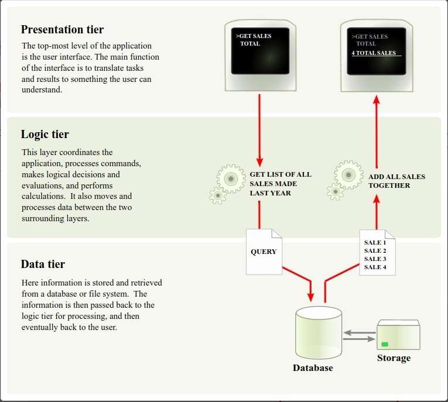
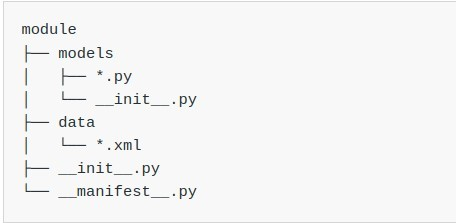

# **_Chapter 1: Architecture Overview_**

## **Multitier application**

> Odoo follows a **multitier architecture**, meaning its a three-tier as bellow...

- Presentation tier
  - combination of
    - HTML5
    - JavaScript
    - CSS
- Logic tier
  - Python only
- Data tier
  - only supports PostgreSQL as RDBMS
    - https://beta.openai.com/playground/p/6N1M6BDGpDrzb6lmoWI4AX1a

## **Odoo Module**

> A module is a collection of functions and data that target a single purpose.
> Everything in Odoo starts and ends with modules.
> Odoo modules can either add brand new business logic to an Odoo system or alter and extend existing business logic. One module can be created to add your country’s accounting rules to Odoo’s generic accounting support, while a different module can add support for real-time visualisation of a bus fleet.
> Terminology: developers group their business features in Odoo modules. The main user-facing modules are flagged and exposed as Apps, but a majority of the modules aren’t Apps. Modules may also be referred to as addons and the directories where the Odoo server finds them form the addons_path.

### _Composition of a module_

> Nono of bellow elements are mandatory. Some modules may only add data files (e.g. country-specific accounting configuration), while others may only add business objects.

**Business objects**

- Python class
  - The fields defined in these classes are automatically mapped to database columns thanks to the ORM layer.

**Object views**

- Define UI display

**Data files**

- XML or CSV files declaring the model data:
  - views or reports
  - configuration data (modules parametrization, security rules)
  - demonstration data
  - and more

**Web controller**

- Handle requests from web browsers
- Static web data
  - Images, CSS or JavaScript files used by the web interface or website

## **Module Structure**

- Each module is a directory within a module directory.
  - Module directories are specified by using the --addons-path option.
- An Odoo module is declared by its manifest.
- When an Odoo module includes business objects (i.e. Python files), they are organized as a Python package with a \_\_init\_\_.py file. This file contains import instructions for various Python files in the module.
- Here is a simplified module directory:
  
