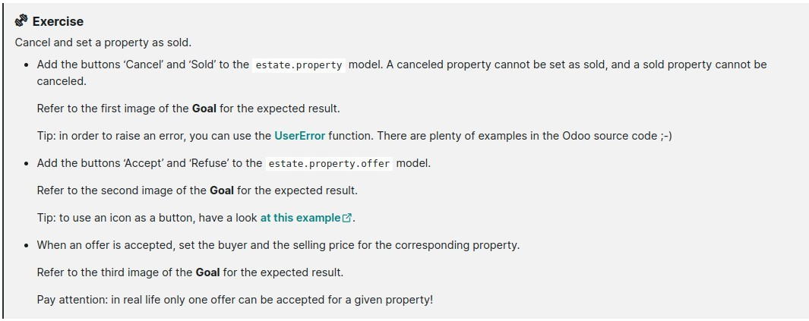

# **_Chapter 10: Ready For Some Action?_**

- In any real business scenario, we would want to link some business logic to action buttons.

- In our real estate example, we would like to be able to:

  - cancel or set a property as sold

  - accept or refuse an offer

    - Moreover, we want to add some extra processing: when an offer is accepted we want to set the selling price and the buyer for the property.

## **Action Type**

**Reference:** [Actions](https://www.odoo.com/documentation/16.0/developer/reference/backend/actions.html#reference-actions) [Error management](https://www.odoo.com/documentation/16.0/developer/reference/backend/orm.html#reference-exceptions)

- The most common way to link business logic with some buttons is to:

  1. Add a button in the view, for example in the **header** of the view:

  - 

  2. and link this button to business logic:

  - 

    - This method needs to be called by the user through the button, so of course it cannot be private, must be **public**.

    - We loop on self.

      - Always assume that a method can be called on **multiple records**

        - it’s better for **reusability**.

        - this sentence make sure that **self** represents **records**.

    - Public methods **should always** return something.

      - So that it can be called through **XML-PRC**.

      - When in doubt, just return **True**.

  - **More examples:** [button in a view](https://github.com/odoo/odoo/blob/cd9af815ba591935cda367d33a1d090f248dd18d/addons/crm/views/crm_lead_views.xml#L9-L11), [corresponding Python method](https://github.com/odoo/odoo/blob/cd9af815ba591935cda367d33a1d090f248dd18d/addons/crm/models/crm_lead.py#L746-L760)

### _Exercise: Cancel and set a property as sold_

**Sold\/Cancel & UserError**

**Accept\/Refuse Offer**

**When Offer Accept, Buyer of property update**

## **Object Type**

> In [Chapter 6. UI](https://github.com/echoedinvoker/Odoo14tt/blob/master/14/tutorial/6-ui/memo.md), we create actions and linked them to menu, is it possible to link actions to button?

- sure it is.

  - 
