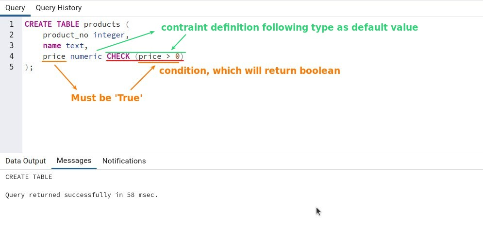
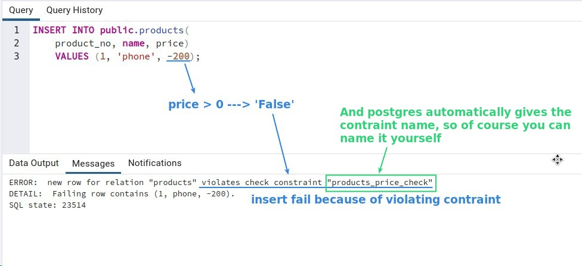
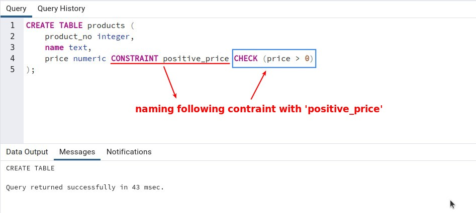
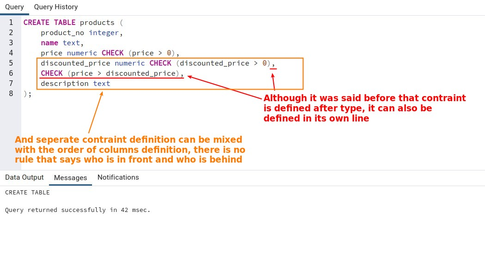
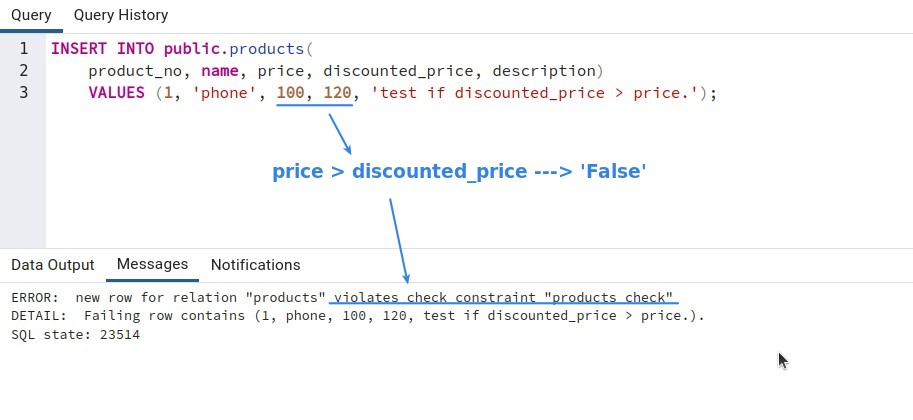
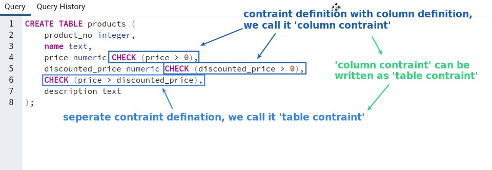
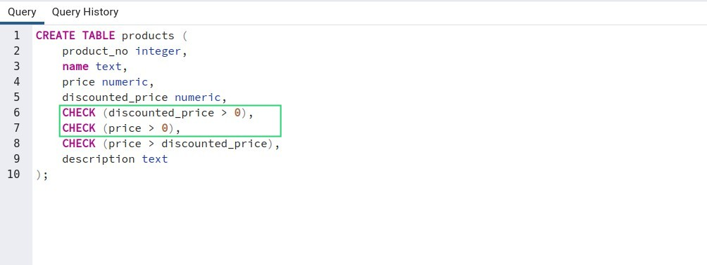
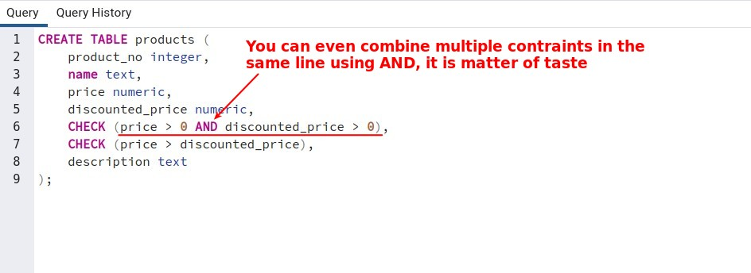
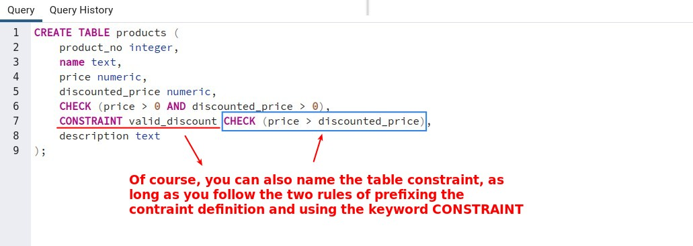

## **Define Check Constraint**

> Because type is not enough to have sufficient specification of data, for example, if it is the price of a product, it must be a positive number, but there is no conforming type that can be specified, then you must use constraint.

> Even the default value will be checked by constraints.

**constraint which return boolean**

- A constraint is defined as a condition that returns a boolean, we call this constraint a 'check constraint'.

**test**

## **Naming the Constraint**

## **Column/Table Constraint**

## **Other**

### _Combine constraints with AND_

### _Naming table constraint_

