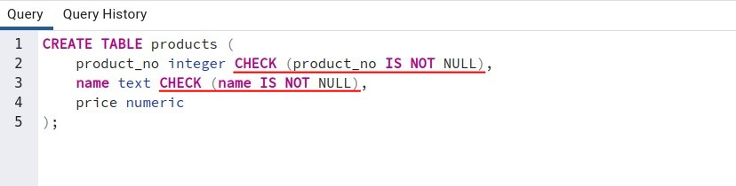
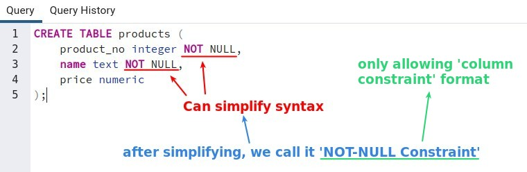
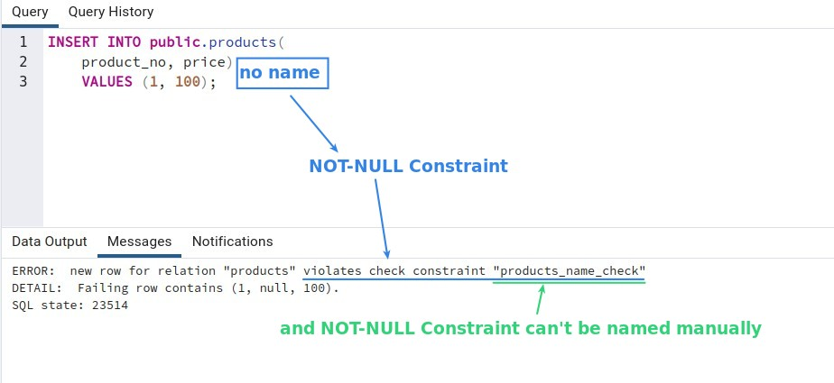
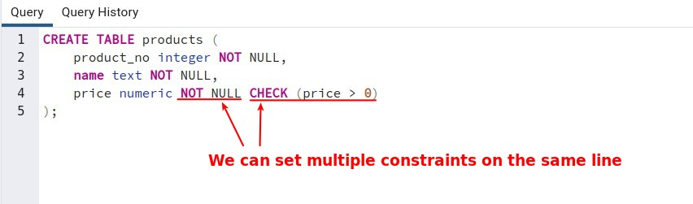

## **Not-null is a simplification from Check constraint**

## **Test and Features of Not-null constraint**

**Insert test**

**Multiple column constraints**

- There can be multiple column constraints behind the same column definition, also including Not-null.
