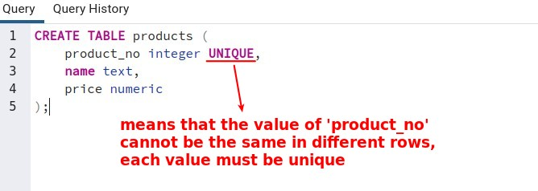
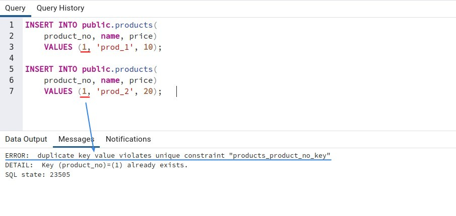
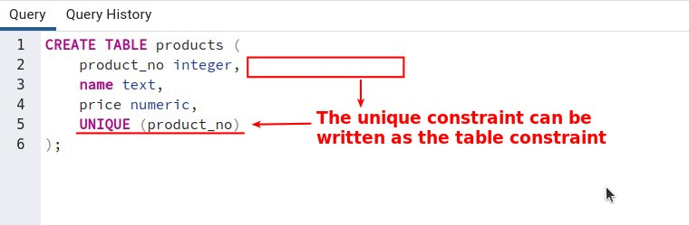
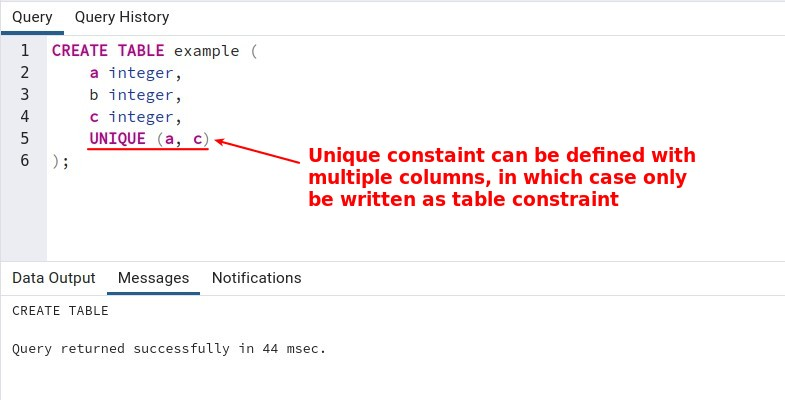
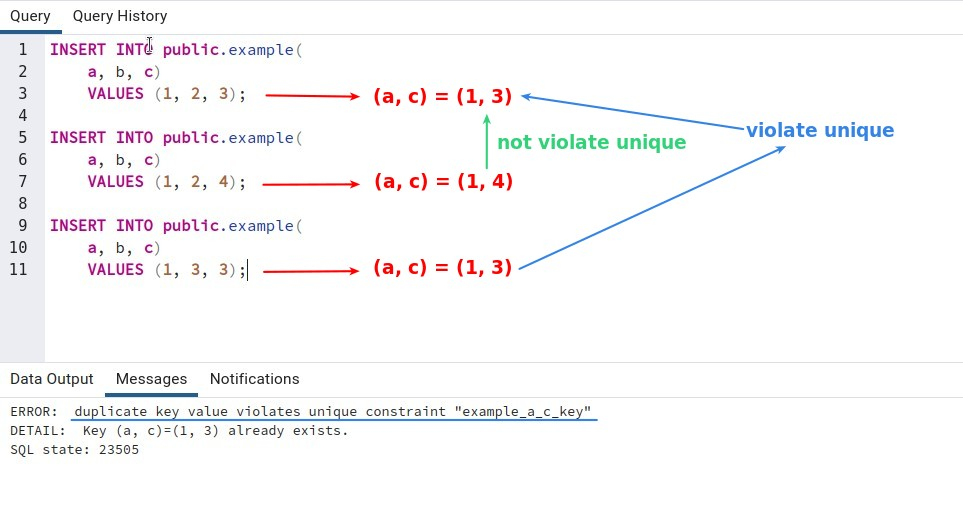
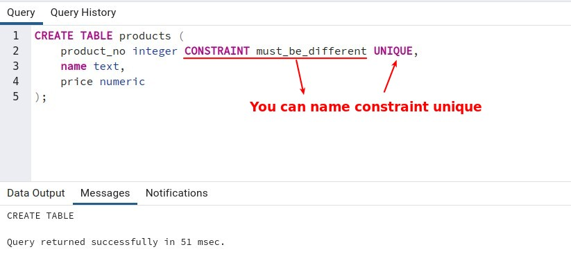
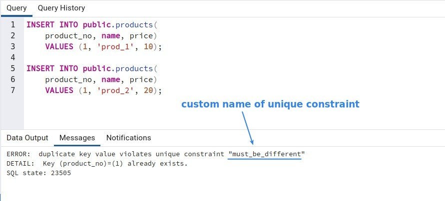
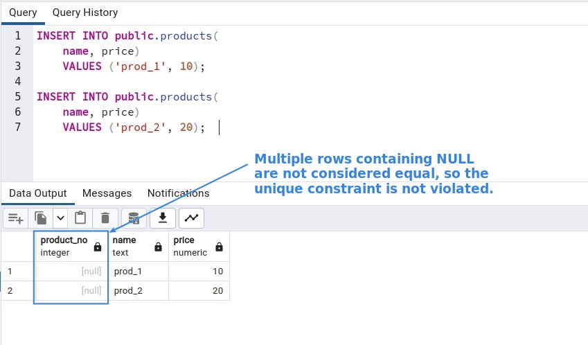

## **Unique constraint written as column constraint**

## **Unique constraint written as table constraint**

### _Defining unique constraint with multiple columns_

## **Naming Unique constraint**

## **How about multiple nulls**

## **Incomprehensible topics**

- Adding a unique constraint will automatically create a unique B-tree index on the column or group of columns listed in the constraint. A uniqueness restriction covering only some rows cannot be written as a unique constraint, but it is possible to enforce such a restriction by creating a unique partial index.

- NULLS NOT DISTINCT (syntax errors occur during practice)
