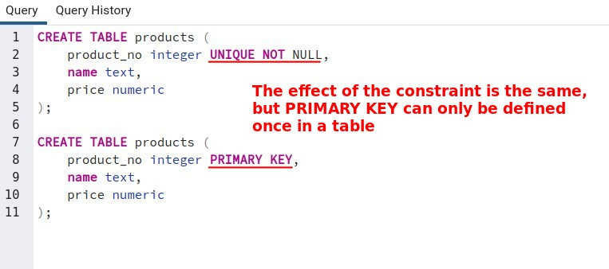
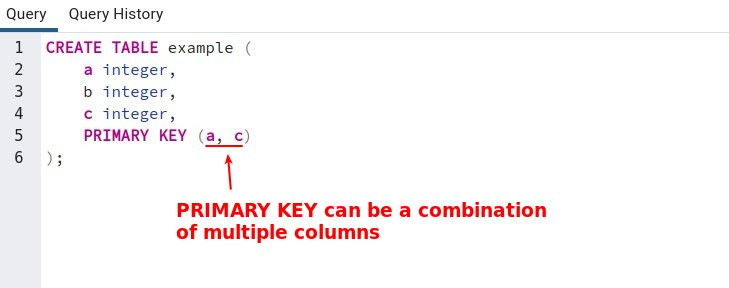

## **What is PRIMARY KEY**

> If a column want to be a primary key, it must have unique constraint and not null constraint.

- Relational database theory dictates that every table must have a primary key. This rule is not enforced by PostgreSQL, but it is usually best to follow it.

## **It can combined with multiple columns**

## **Usage**

- can be used to identify rows in the database.

- If a table is referenced, the primary key of the table is expected to be used as the foreign key.
