## **REFERENCE**

> We use REFERENCE this keyword to create foreign key constraint, instead of FOREIGN KEY.

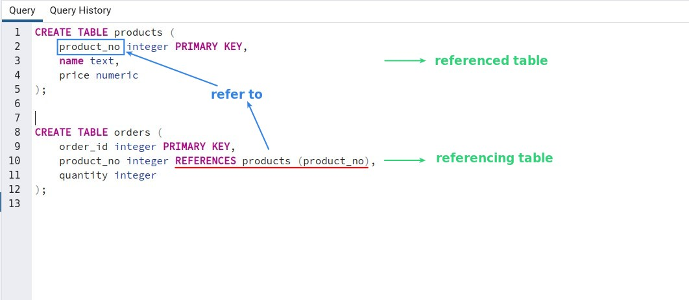

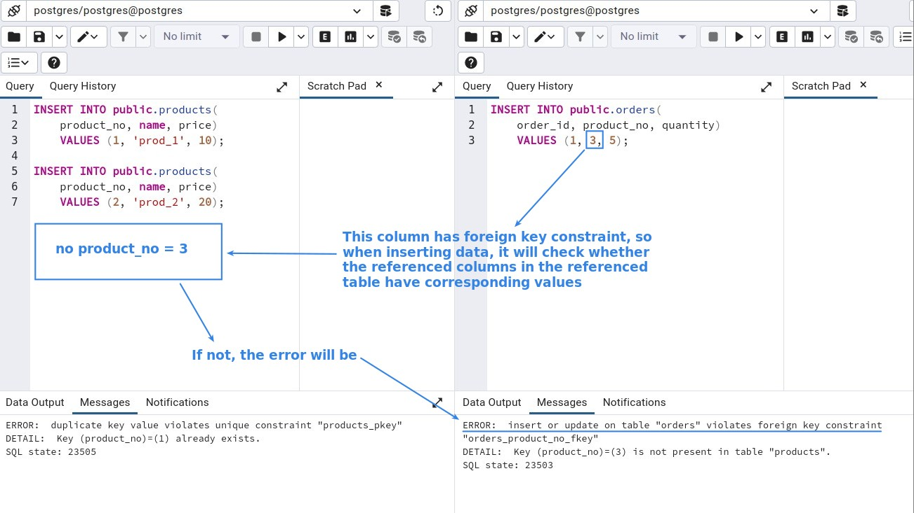

## **Features of Foreign key**

### _Allow null_

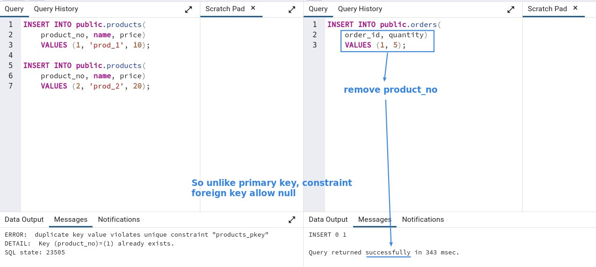

### _Omit reference column name_

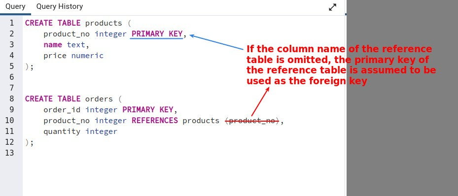

### _Multiple ..._

**Columns**

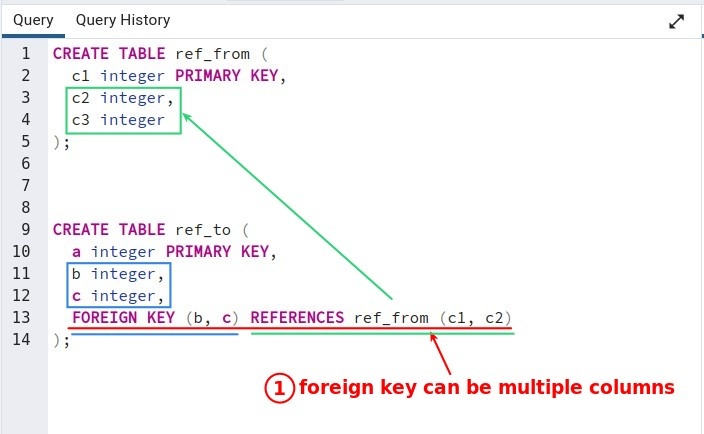

**Foreign keys**

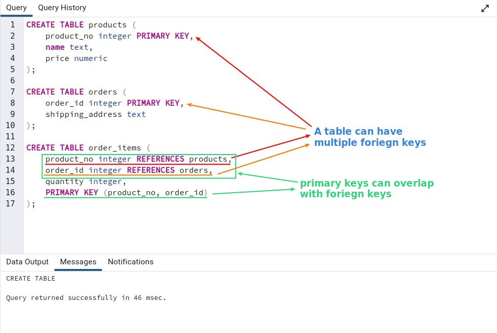

## **Node Structure**

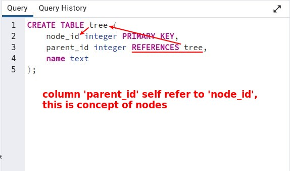

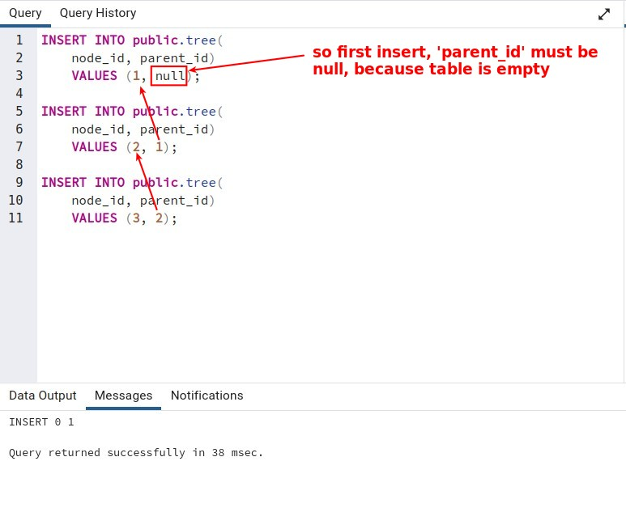

## **ON DELETE**

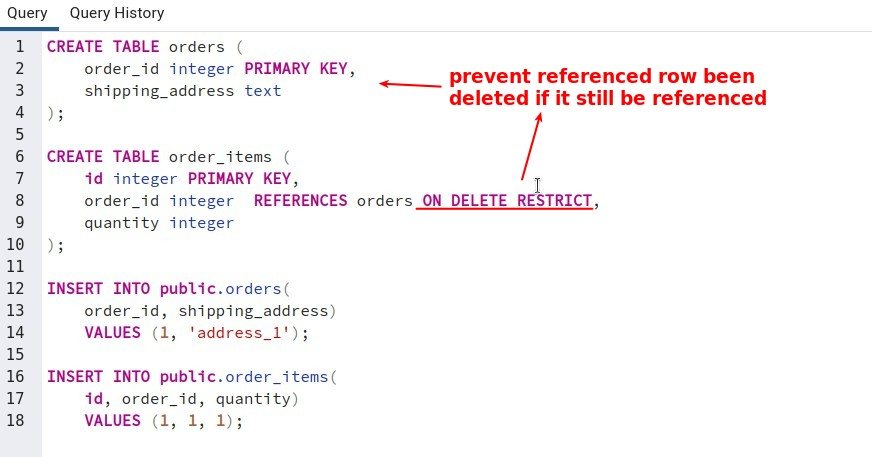

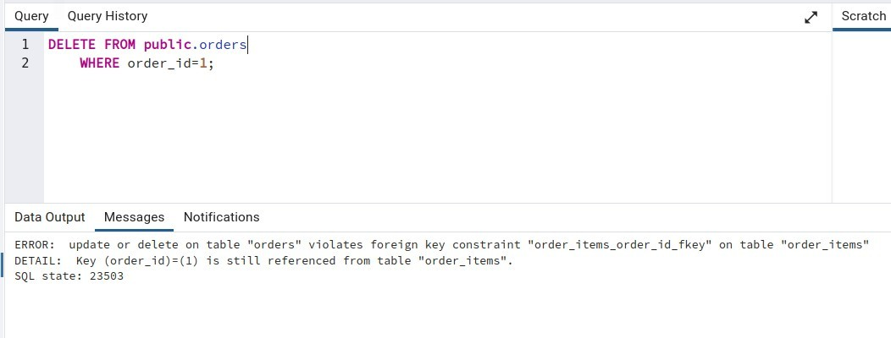

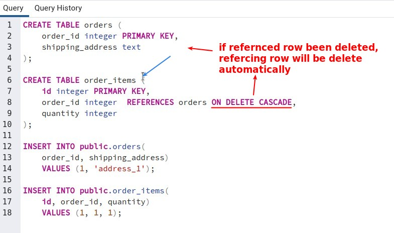

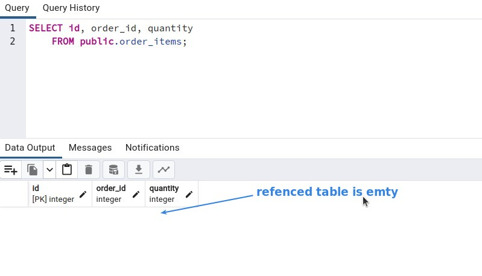
