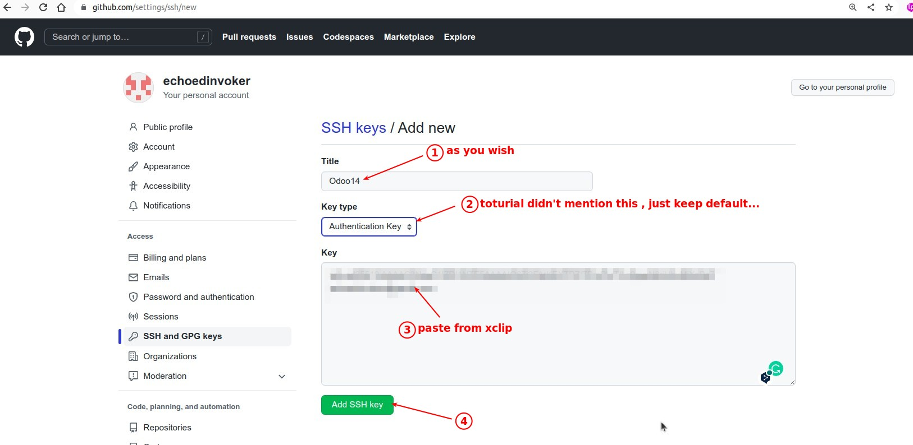

# **_Chapter 2: Development environment setup_**

> There are multiple ways to install Odoo. This toturial will stick to the **source install**, which is best suited for Odoo developers.

## **Set up Git**

### _Install and Configure Git_

pass

### _Configure GitHub_

> The easiest way to authenticate with GitHub is to use an SSH connection. Using SSH authentication allows you to connect to GitHub without supplying your username and password every time you type a command.

**Generate ssh-key**

**Add key to ssh-agent, then use "xclip" to copy ssh-key to clipboard**

- https://beta.openai.com/playground/p/ed2LiT3Pqetr4PLwiStAeTxW

**Steps of Paste SSH-Key to GitHub**

## **Fetch the sources**

> Time to fetch the source code of Odoo. First, let's create a home for the Git repositories in $HOME/src/.

### _Create "src" folder for Git repositories_

- Then, fetch source codes... It will take a long time.

### _Fetch Odoo community_

### _Fetch Odoo enterpise_

## **Configure the Git repositories**

> To contribute to an Odoo repository, you first need to fork it, then create a branch containing your changes on the fork, and finally submit a Pull Request to the repository.
> https://beta.openai.com/playground/p/nGDY2gOUWuWadfY9HGj9ahq2

### _Fork_

- I unchecked it, but not sure what's going on...

### _Git remote_

- https://beta.openai.com/playground/p/E5ytF3Jao6NTKhVBGrR7YfXh

## **Install the dependencies**

### _Check Python version and if pip is installed_

### _PostgreSQL_

**install**

**User and DB**

### _apt-get Install dependencies_

### _pip3 install dependencies_

### _npm install dependency_

### _Tip of useful SQL commands_

