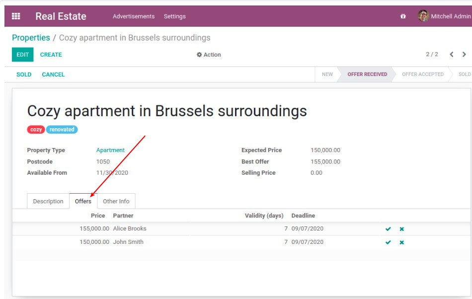

## **Overview of "Real Estate" module**

> This is the module we toturial to complete, the following is the final look, the goal of this chapter is only to make empty shell.

### _Final Overview_

**Top level**

**First Tab**

**Second Tab**

### _Goal of this chapter: Empty shell_

> The goal of this section is to make the module of the empty shell, and to be able to find it in the website.

## **Start to create the module**

### _Create folders and files_

### _example of \_\_manifest\_\_.py_

### _Write our \_\_manifest\_\_.py_

## **Find out our custom module**

### _Launch Odoo server which loading our "custom" folder_

### _Filter out our module_

