## **Goal: Create table by ORM**

### _Goal_

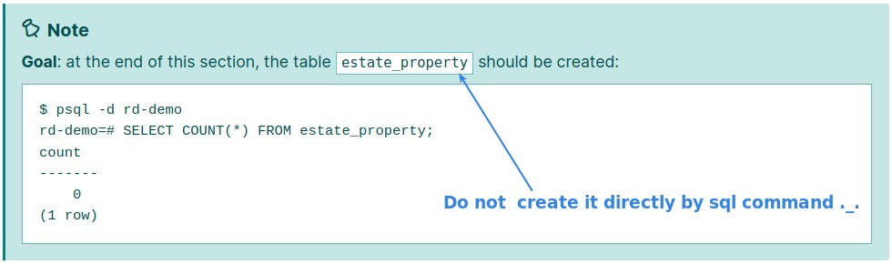

### _Smallest model script_

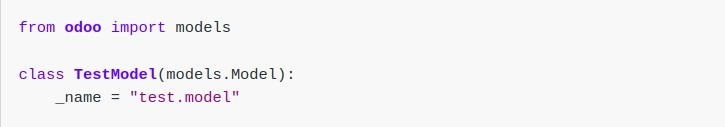

### _CRM model & file structure_

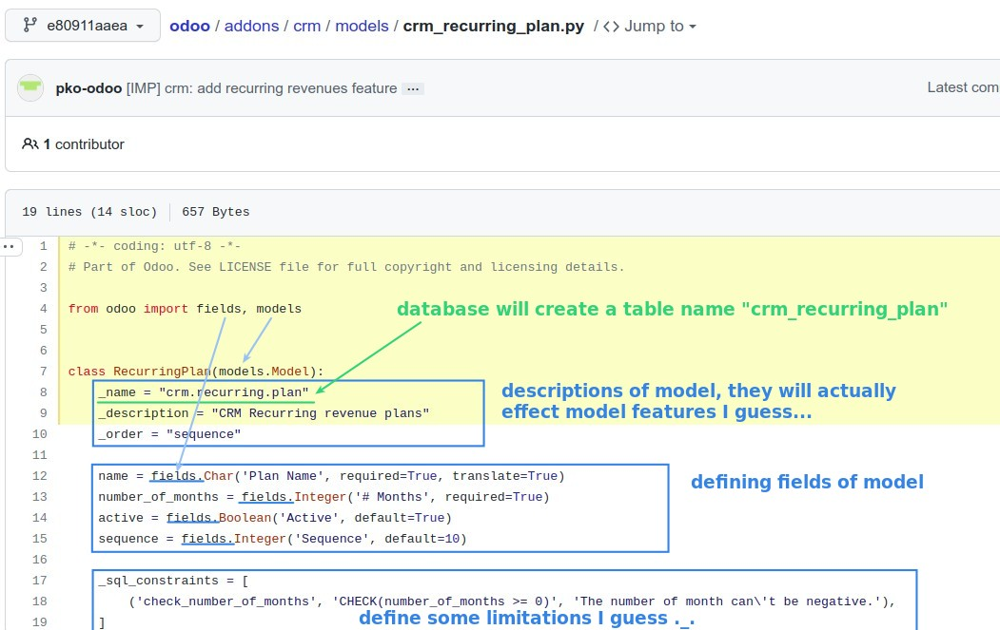

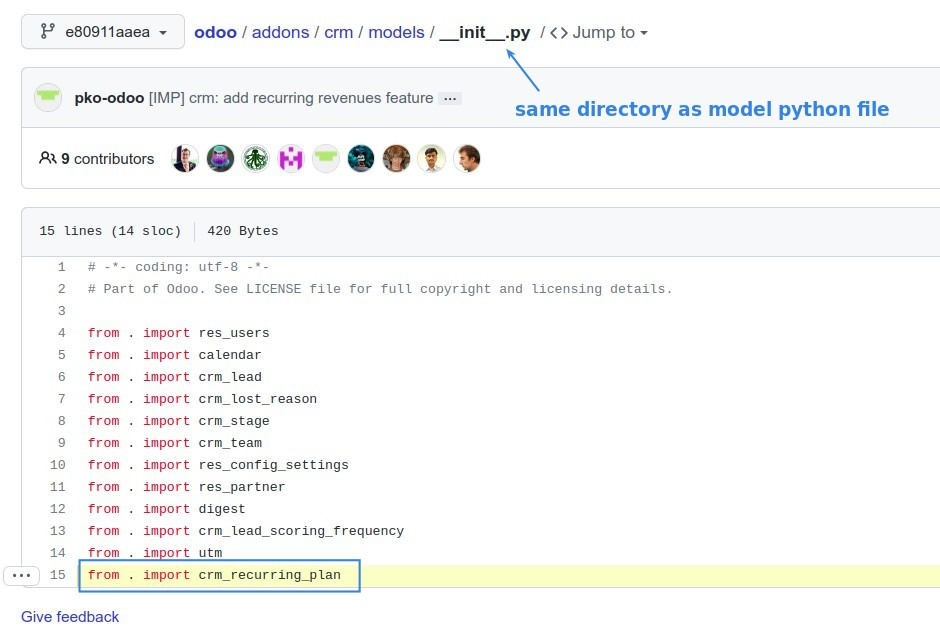

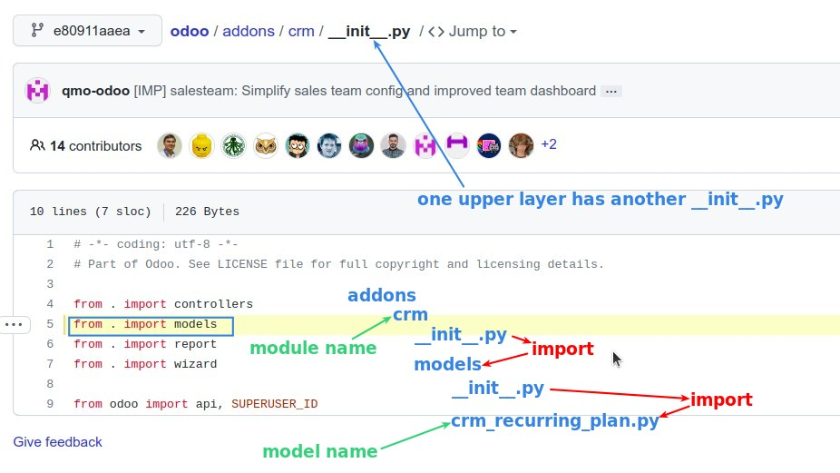

### _Create file structure_

### _Edit contents of model with smallest one_

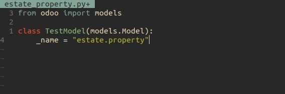

### _bottom layer **init**.py_

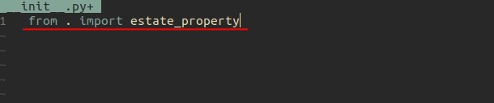

### _uppter layer **init**.py_

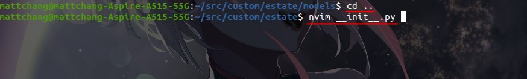

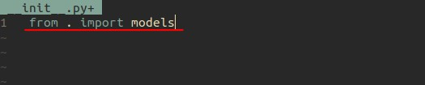

### _Update module & Check result in the database_

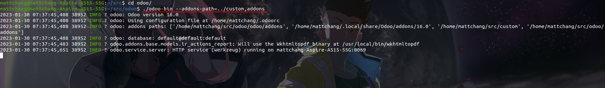

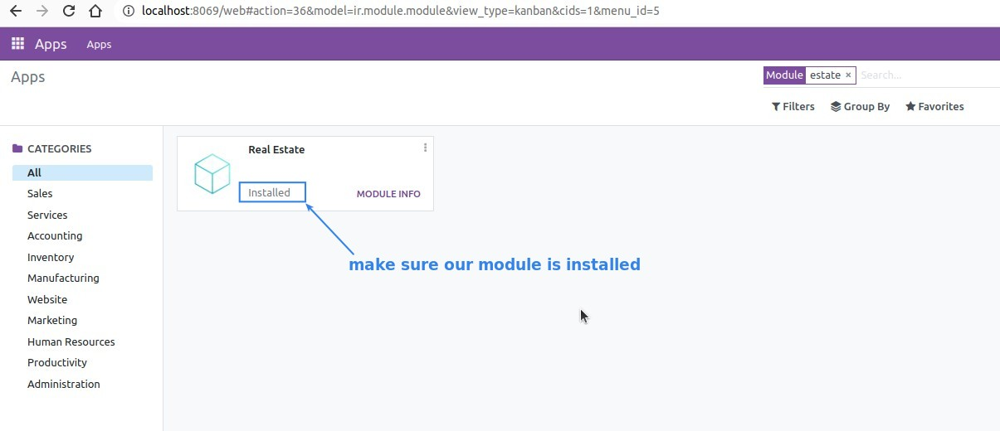

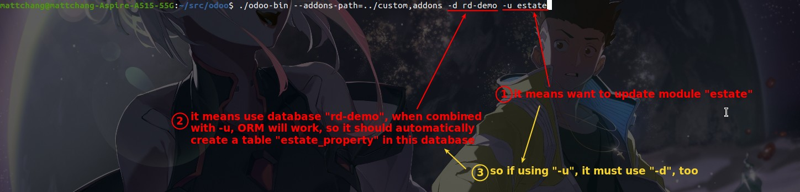

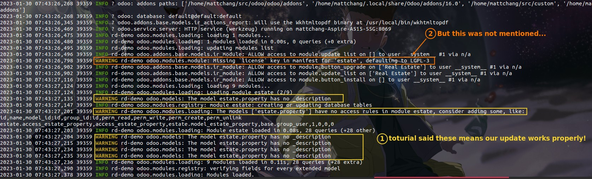

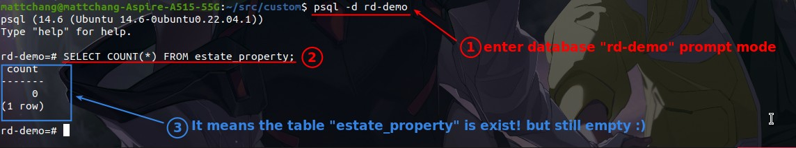

## **Exercise: Add \_description in model**

### _exercise instruction_

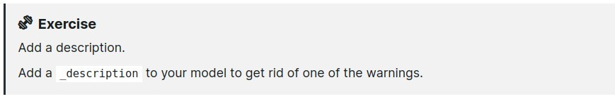

### _Edit contents of model to add \_description_

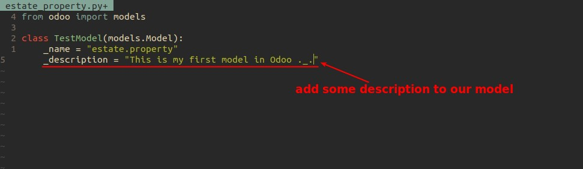

### _Upgrade module and Check the results_

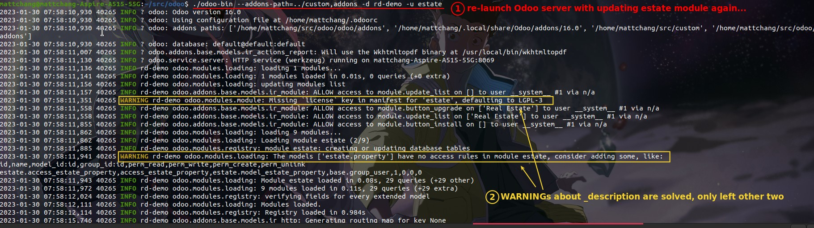

## **Create Fields**

### _simplest sample_

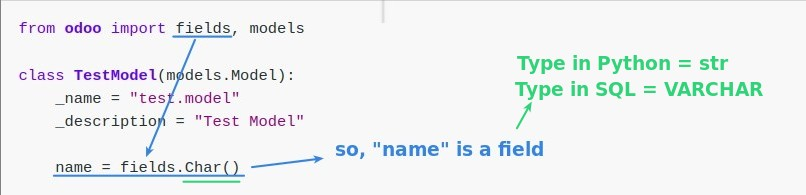

### _Goal & Exercise: add following fields & wanted results in database_

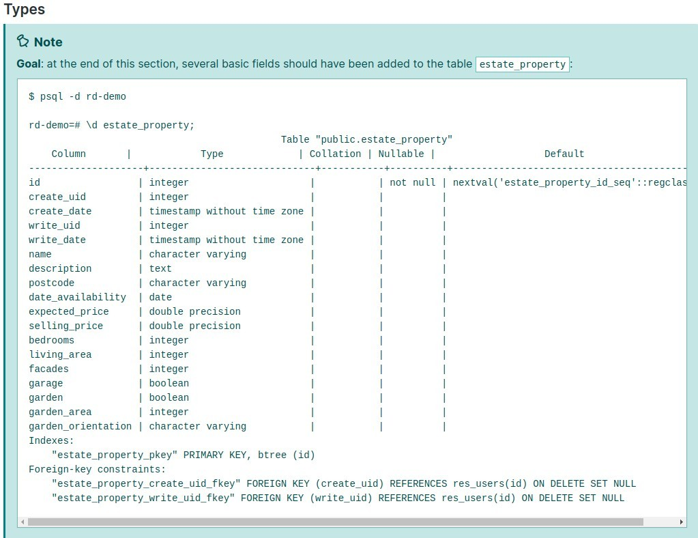

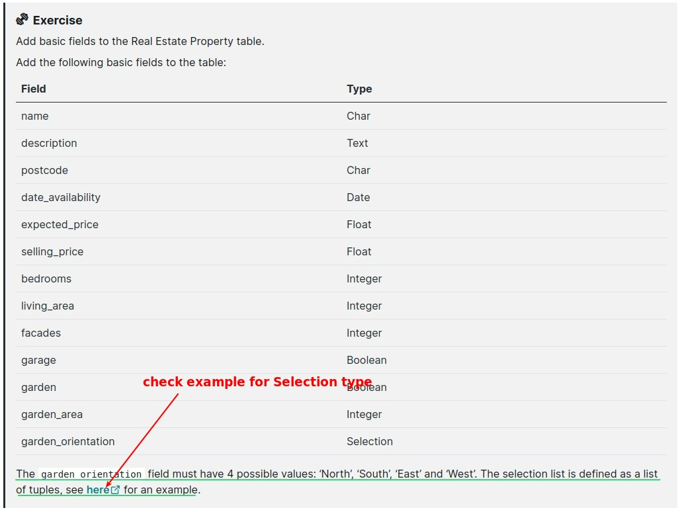

**Type Selection**
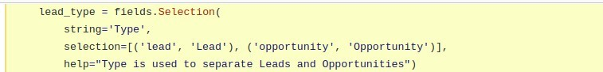

### _Edit contents of model to add fields_

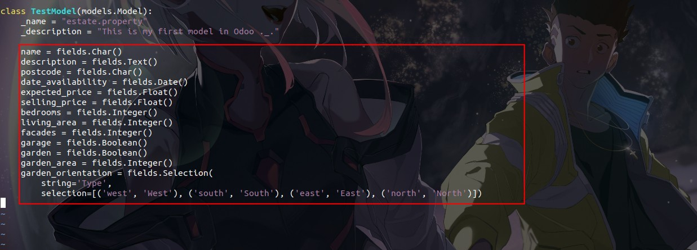

### _Upgrade Module & Check the results_

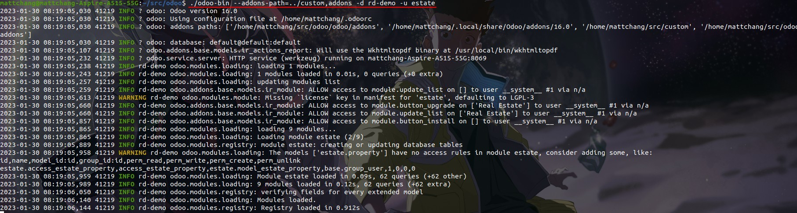

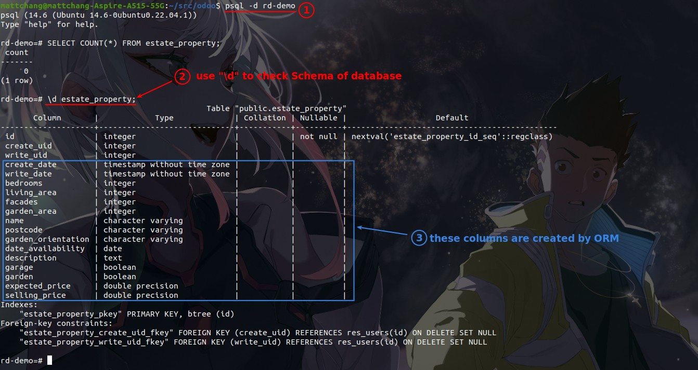

## **Configure fields**

### _passing configuration as arguements_

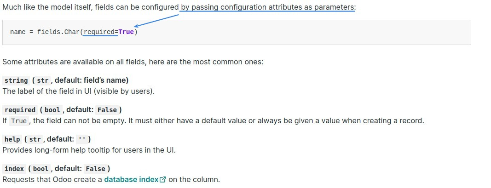

### _Exercise: add bellow configuration to specific fileds_

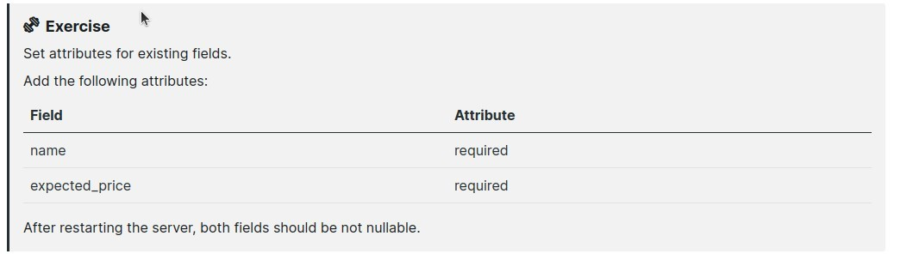

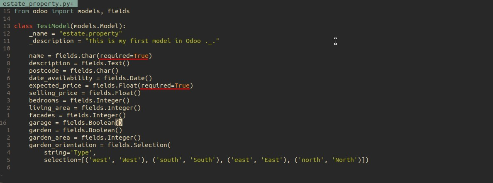

### _Upgrade Module & Check the results_

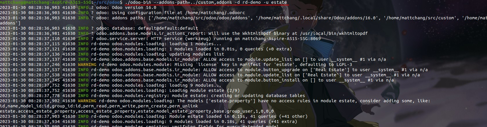

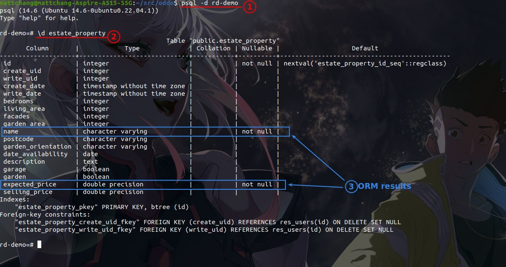
