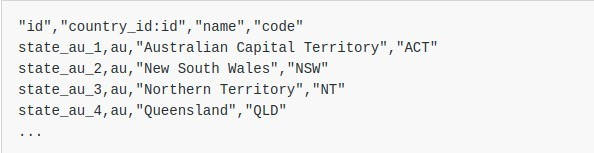
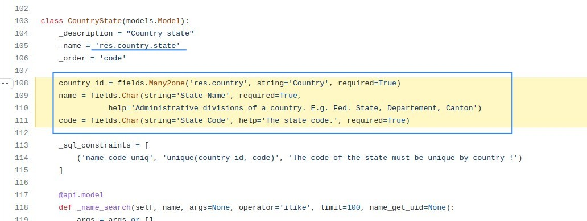
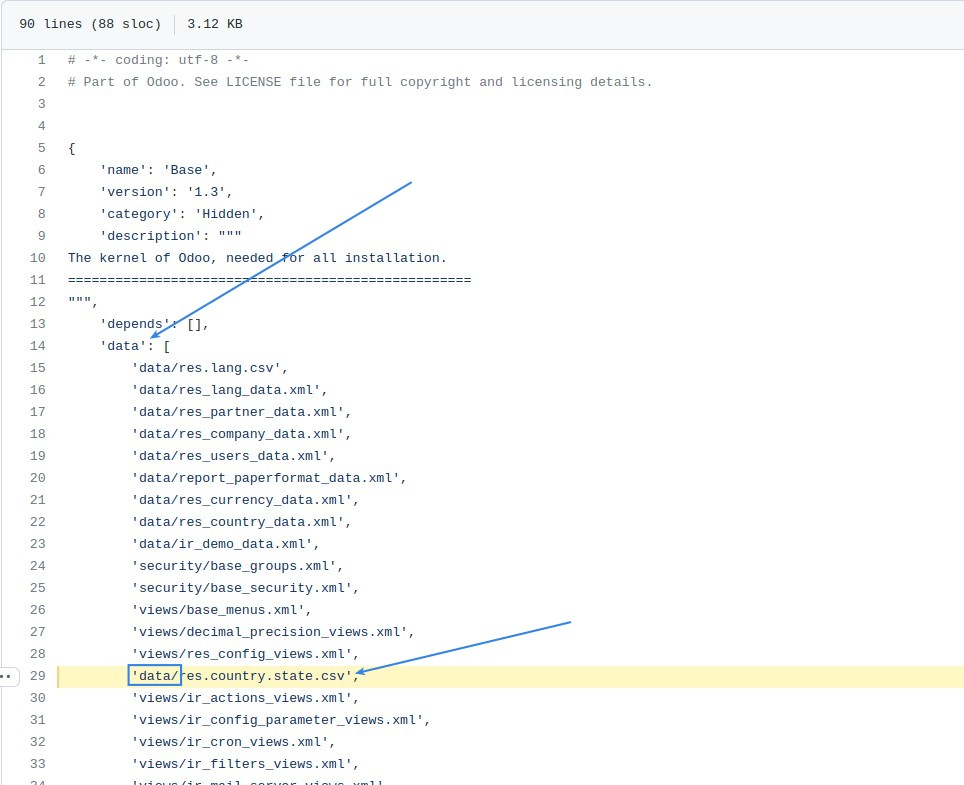
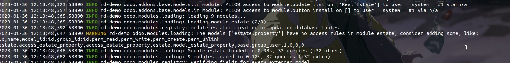
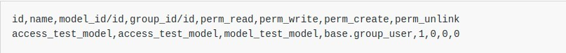
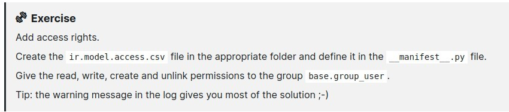
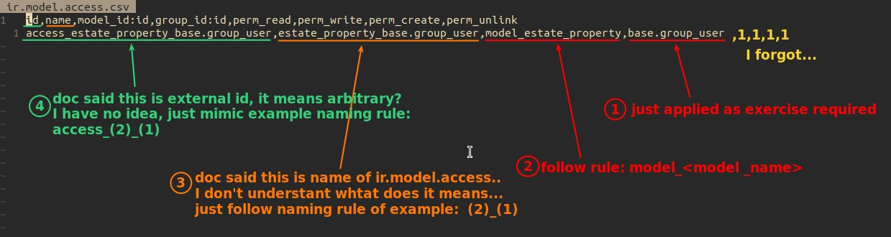
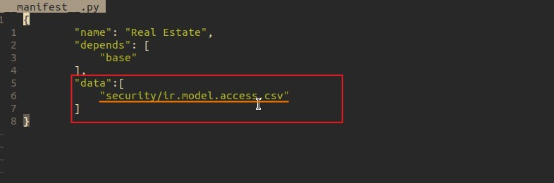
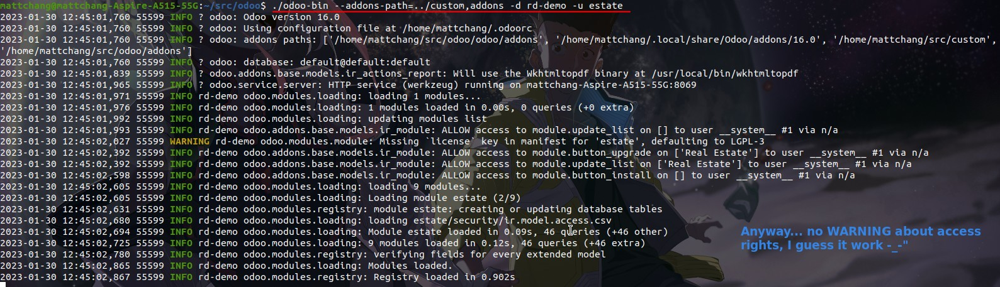

# **_Chapter 5: Security - A Brief Introduction_**

> Last chapter, we create our first table intended to store buniness data, but who can access it? Odoo provides a security mechanism to allow access to the data for specific groups of users.

> This chapter aims to cover the minimum required for our new module.

> More detail in [Advanced B: ACL and Record Rules](https://www.odoo.com/documentation/16.0/developer/howtos/rdtraining/B_acl_irrules.html#howto-rdtraining-b-acl-irrules).

## **Data Files (CSV)**

- Odoo is highly data driven system.
  - Part of module's value is in the data it sets up when loaded (installed or updated)
- One of data files is CSV file, example as bellow:
  
  - **id** is external identifier.
    - What is external identifier?
      - string identifier
      - stored in **ir.model.data**
  - **country_id:id** refer to the country by using its external identifier.
    - "refer to" is important, ":id" indicate it.
    - can be used to refer to a record regardless of its database identifier during data imports or export/import roundtrips
    - in the form **module.id**
      - if within a module, the module prefix can be left out.
  - **name**, simply name of state.
  - **code**, simply code of state.
- **country_id, name, code** these three fields are defined in the **res.country.state** model.
  - It means all column's names in data files (exclude first id), must be define in the certain model, or it can't be import properly.
    

### _Where to located file, which importing data?_

- normally - data folder
- is related to security - security folder
- is related to views and actions - views folder

### _All files that importing data must list in the **data** within \_\_manifest\_\_.py_

### _Note that data files loaded order_

- The data files are sequentially loaded following their order in the \_\_manifest\_\_.py file. This means that if data A refers to data B, you must make sure that B is loaded before A.
- In the case of the country states, you will note that the list of countries is loaded before the list of country states. This is because the states refer to the countries.

## **Access Rights**

> Access rights is the definition of which models can be accessed by which user groups, which is also defined using data files, so this chapter is clearly about security, but the first half is all about data files.

[Reference](https://www.odoo.com/documentation/16.0/developer/reference/backend/security.html#reference-security-acl)

### _if no access rights are defined_

- No access rights are defined, it means no users can access the data.
- Access rights are defined as records of the model **ir.model.access** as bellow:
  
  - **id** = external identifier
  - **name** = name of the ir.model.access
  - **model_id/id** = refer to the model which the access right applies to.
    - standard way to refer to the model is \*\*model\_<model_name>
      - <model*name> is the \_name of the model with . replaced by *
  - **group_id/id** = refer to the group which the access right applied to
    - this concept will be cover in the [advanced topic](https://www.odoo.com/documentation/16.0/developer/howtos/rdtraining/N_security.html#howto-rdtraining-n-security)
  - **perm_read,perm_write,perm_create,perm_unlink**
    - read, write, create and delete permissions on/off

## **Exercise**

### _Instruction_

### _Solution_

**Create correct folder for importing data file**

**Edit contents of it (Access rights)**

**List importing data file in the \_\_manifest\_\_.py**

**Launch & upgrate module**

## **Asking AI**

- https://beta.openai.com/playground/p/4OqCW9blwtjF9vLQrA3cRYrB
