# **_Chapter 7: Basic Views_**

- In practice, the default view is never acceptable for a business application. Instead, we should at least organize the various fields in a logical manner.

- Views are defined in XML files with actions and menus.

  - They are instances of the **ir.ui.view** model.

- In our real estate module, we need to organize the fields in a logical way:

  - in the list (tree) view

    - we want to display more than just the name.

  - in the form view

    - the fields should be grouped.

  - in the search view

    - we must be able to search on more than just the name.

    - Specifically, we want a filter for the ‘Available’ properties and a shortcut to group by postcode.

## **List**

[Reference](https://www.odoo.com/documentation/16.0/developer/reference/backend/views.html#reference-views-list)

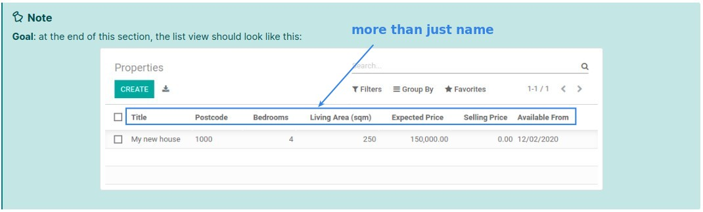

- root element is \<tree\>

- display records in a **tabular** form.

- smallest sample:

  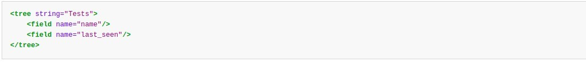

- [CRM example](https://github.com/odoo/odoo/blob/6da14a3aadeb3efc40f145f6c11fc33314b2f15e/addons/crm/views/crm_lost_reason_views.xml#L46-L54)

### _Exercise: Add a custom list view_

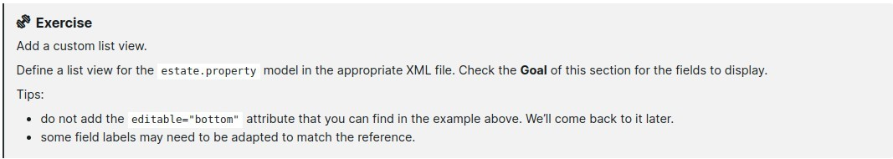

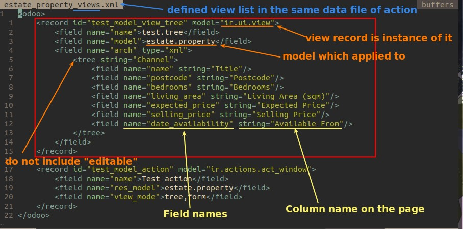

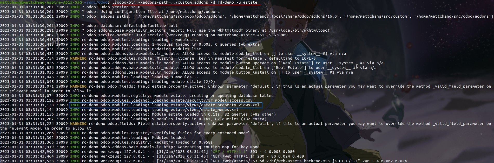

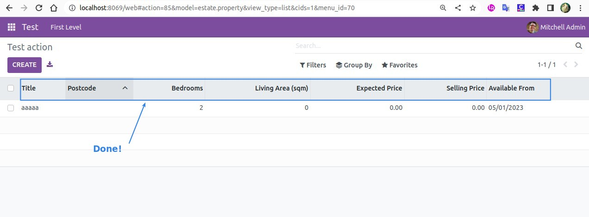

## **Form**

[Reference](https://www.odoo.com/documentation/16.0/developer/reference/backend/views.html#reference-views-form)

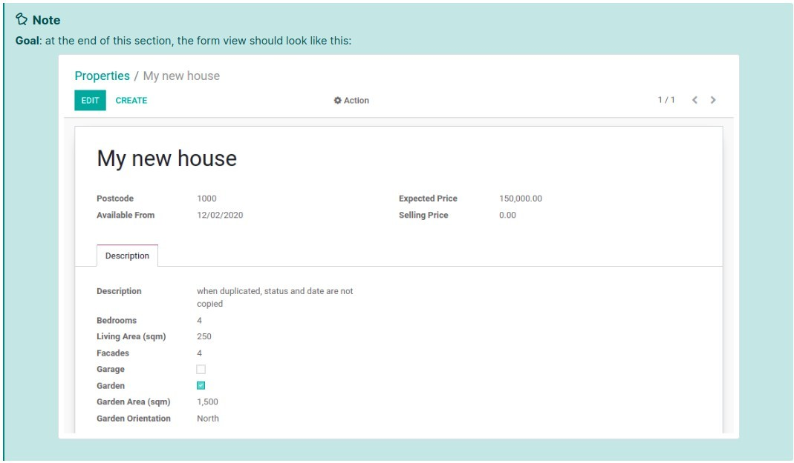

- used to create and edit **single** records.

- root element is \<form\>.

  - composed of high-level structure elements (groups and notebooks) and interactive elements (buttons and fields).

  - It is possible to use regular HTML tags:

    - such as **div** and **h1**

  - as well as the **class** attribute to fine-tune the look

    - Odoo provides some build-in classes

- smallest sample:

  

- [CRM sample](https://github.com/odoo/odoo/blob/6da14a3aadeb3efc40f145f6c11fc33314b2f15e/addons/crm/views/crm_lost_reason_views.xml#L16-L44)

  - [Ask AI: Tags](https://platform.openai.com/playground/p/qPwaVmZQKq8ggCuuWc85kSRl)

### _Exercise: Add a custom form view_

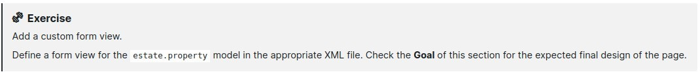

- This misght require some trial and error.

- Advice adding the fields and tags one at a time to understand how it works.

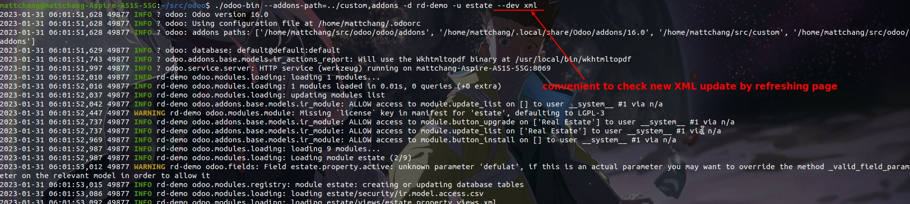

- add **--dev xml** to launch will be more convenient.

**Practice**

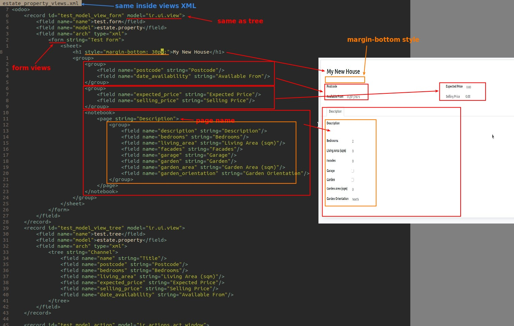

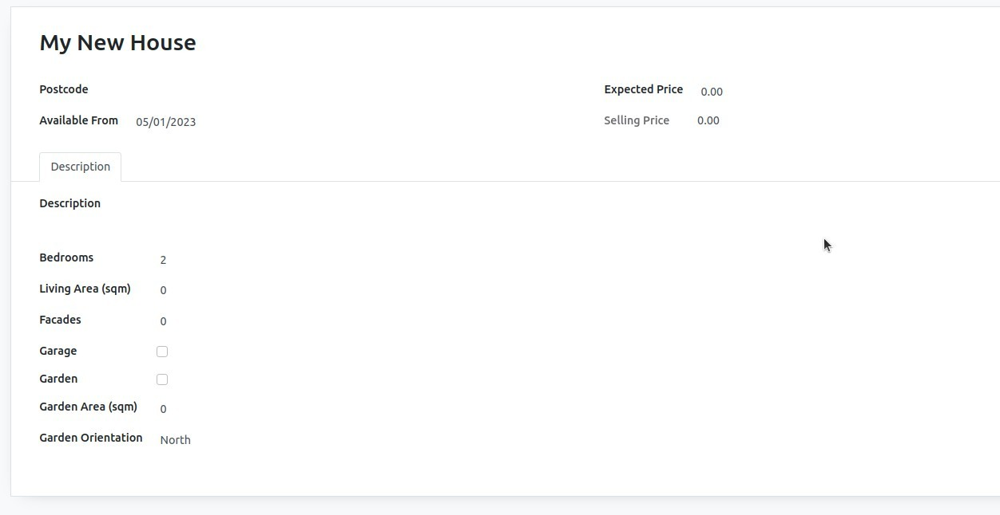

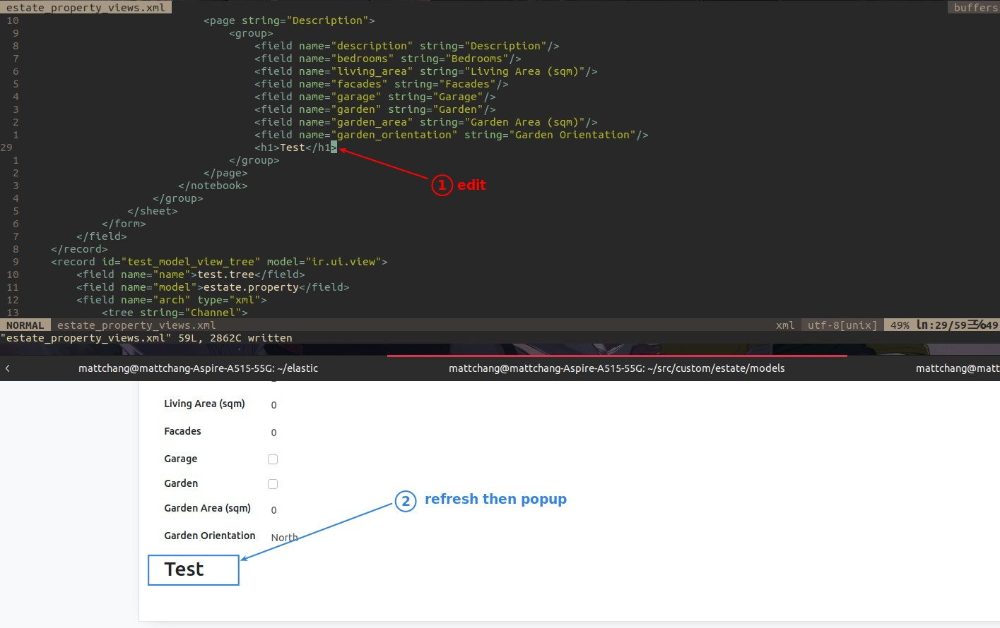

## **Search**

[Reference](https://www.odoo.com/documentation/16.0/developer/reference/backend/views.html#reference-views-search)

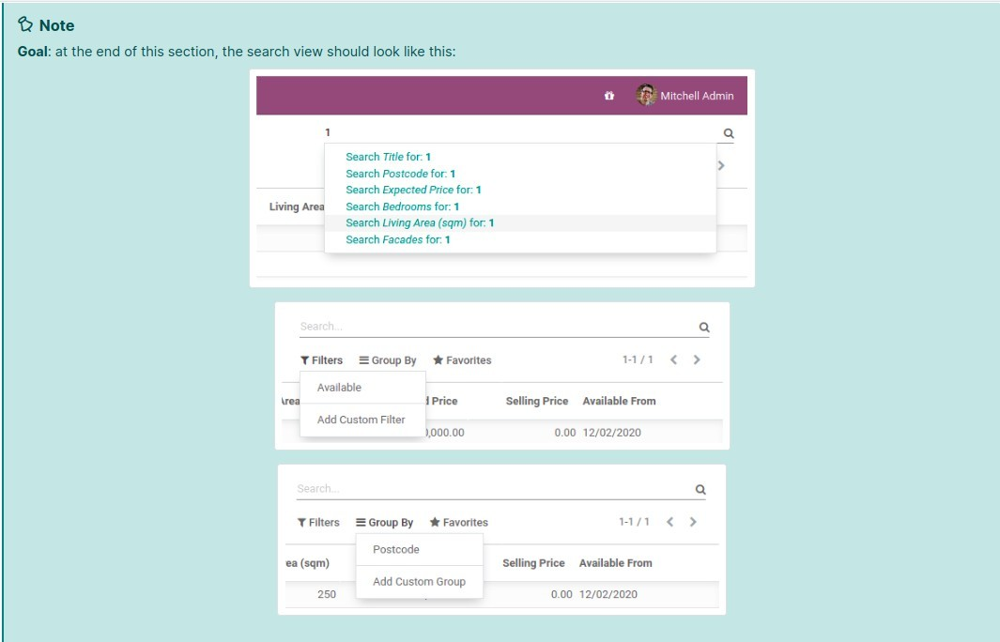

- it don't display content but to filter other views' content (usually aggregated views such as List)

- Although use case is different, but it is defined in the same way.

- root element is \<search\>.

- smallest search view sample:

  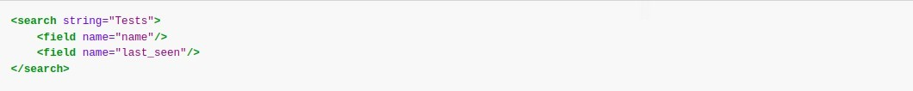

### _Exercise: Add a custom search view_

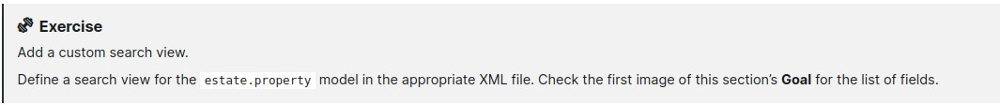

- it can also contain \<filter\> elements.

  - it act as toggles for predefined searches.

  - it must have one of the following attributes:

    - **domain**

      - adds the given domain to the current search

    - **context**:

      - adds some context to the current search

      - use the key **group_by** to group results on the given field name

- [CRM example](https://github.com/odoo/odoo/blob/715a24333bf000d5d98b9ede5155d3af32de067c/addons/delivery/views/delivery_view.xml#L30-L44)

**Practice**

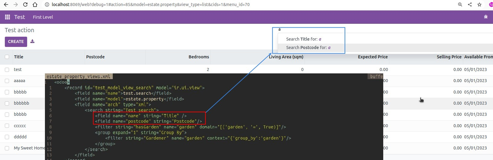

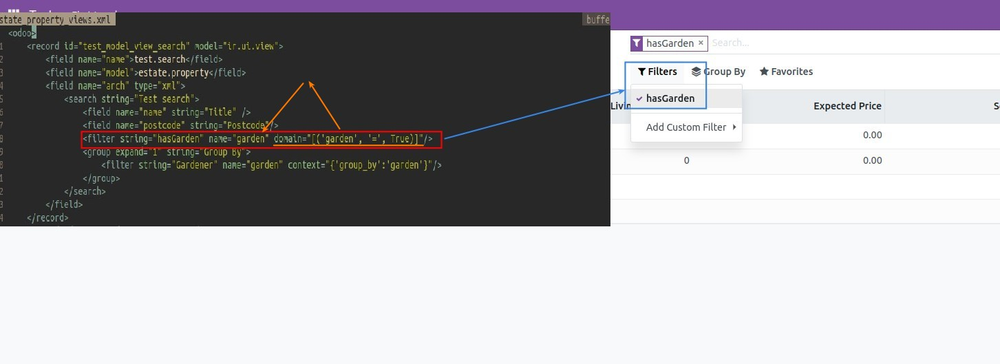

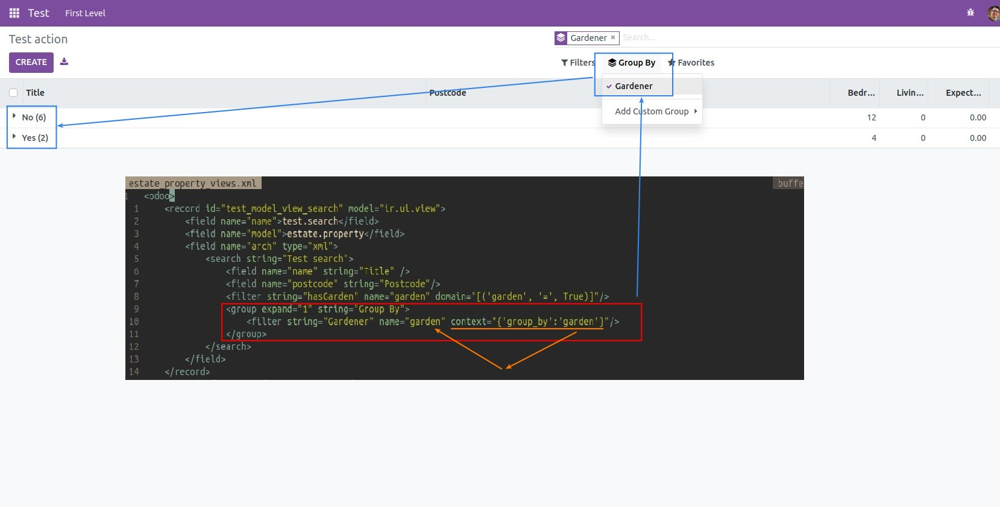

## **Domains**

[Reference](https://www.odoo.com/documentation/16.0/developer/reference/backend/orm.html#reference-orm-domains)

- We use domain to select a subset of a model's records.

- it is a list of criteria (conditions)

  - each criteria include:

    - field name

    - operator

    - value

    - example: ("price", ">", 1000) is a criteria.

  - example: [("type", "=", "service"), ("price", ">", 1000)] is a domain.

    - criteria are combined with implicit **AND**.

      - But logical operators can be added in front of criteria (prefix position).

        - logical operators has:

          - & (AND)

          - | (OR)

          - ! (NOT)

        - example: ["!", ("type", "=", "service"), "!", "&", ("price", ">=", 1000), ("price", "<", 2000)]

          - above is to select products which are services OR have a price which is NOT between 1000 and 2000.

### _Exercise: Add filter and Group By_

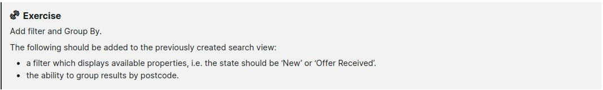

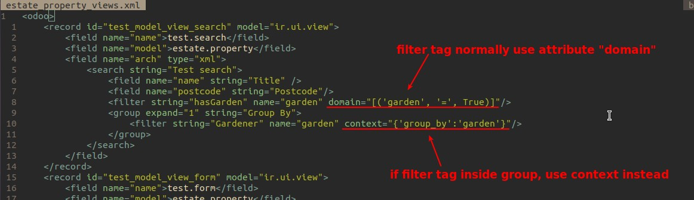
