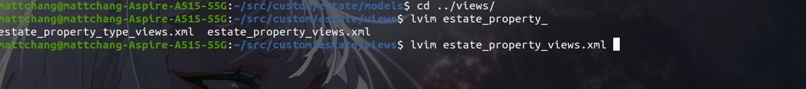
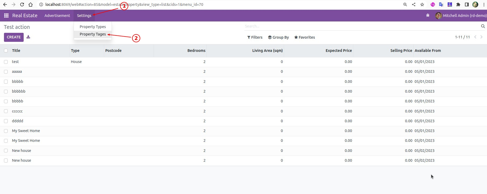
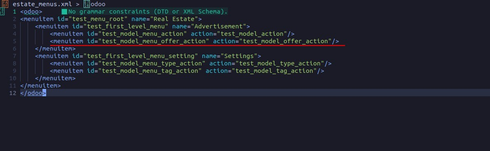
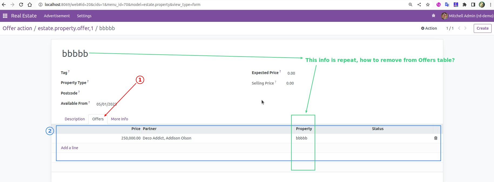

# **_Chapter 8: Relations Between Models_**

> In any real business scenario we need more than one model. Moreover, links between models are necessary.

**In our real estate module, we want the following models:**

- the customer who bought the property

- the real restate agent who sold the property

- the property type:

  - house
  - apartment
  - penthouse
  - castle
  - ...

- a list of tags characterizing the property:

  - cozy
  - renovated
  - ...

- a list of the offers received

## **Many2one**

[Reference](https://www.odoo.com/documentation/16.0/developer/reference/backend/orm.html#odoo.fields.Many2one)

- A property can have one type, but the same type can be assigned to many properties. This is supported by the many2one concept.

- A many2one is a simple link to another object.

  - example: `partner_id = fields.Many2one("res.partner", string="Partner")`

    - It is a field, which is linked to "res.partner".

    - By convention, Many2one field names have the "\_id" suffix.

- In practice a many2one can be seen as a dropdown list in a form view.

- See also: [foreign keys](https://www.postgresql.org/docs/current/tutorial-fk.html)

### _Exercise: Add the Real Estate Property Type table_

### _Another Two Pieces We misses_

- Two other informations we want on property:

  - **buyer**

    - can be any individual

  - **salesperson**

    - must be employee of real estate agency

- Related to this part of the topic, here are two models that we often refer to:

  - **res.partner**

    - is a physical or legal entity, so it can be:

      - a company
      - an individual
      - even just a contact address

  - **res.users** - users of the system

    - internal - have access to the Odoo backend
    - portal - cannot access the backend, only the frontend
      - e.g. to access their previous orders in eCommerce

### _Exercise: Add the buyer and the salesperson_

## **Many2many**

[Reference](https://www.odoo.com/documentation/14.0/developer/reference/addons/orm.html#odoo.fields.Many2many)

- A property can have many tags and a tag can be assigned to many properties. -> **Many2many**

- By convention, Many2many fields have the **\_ids** suffix.

### _Exercise: Add the Real Estate Property Tag table_

## **One2many**

[Reference](https://www.odoo.com/documentation/14.0/developer/reference/addons/orm.html#odoo.fields.One2many)

- An offer applies to **one** property, but the same property can have **many** offers.

  - inverse of Many2one

- example: `test_ids = fields.One2many("test.model", "partner_id", string="Tests")`

  - first parameter = comodel

    - comodel is the abbreviation of "co-model", which is a term used in the Odoo framework to refer to the model that is related to the current model.

    - We use **res.partner** to be comodel in this case (real estate).

      - res.partner is a model in Odoo which is used to store information about people, companies and other entities. It is a core model of Odoo and is used in many other models.

  - second parameter

    - is the field we want to inverse

- By convention, one2many fields have "\_ids" suffix.

- **DANGER** Because a One2many is a virtual relationship, there must be a Many2one field defined in the comodel.

  - [ASK AI: One2many and Comodel](https://platform.openai.com/playground/p/yb51guPVIJhAkie9yoWoh6is)

### _Exercise: Add the Real Estate Offer table_

**We don't need action or menu for all model**

- So View records in XML for offer model only left List view, but server still work properly.

- It means we only access offer model from Form view of estate property.

  - It is normal some model always access by other model.
