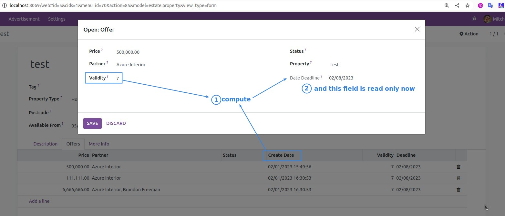

# **_Chapter 9: Computed Fields And Onchanges_**

- Sometimes the value of one field is determined from the values of other fields and other times we want to help the user with data entry.

  - These cases are supported by the concepts of:

    - **computed fields**

    - **onchanges**

## **Computed Fields**

[Reference](https://www.odoo.com/documentation/16.0/developer/reference/backend/orm.html#reference-fields-compute)

- In our real estate module, we have defined **living area** and **garden area**.

  - It is then natural to define the **total area** as the **sum** of both fields above.

- How to create a computed field?

  - set a field's attribute **compute**, and assign it with the name of a method.

    - The computation method should set the value of the computed field for every record in self.

    - By convention, compute methods are **private**.

      - means they cannot be called from the presentation tier, only from the business tier

      - define a method is **private** by add an underscore \_ in front of name of it.

### _Dependencies_

- The value of a computed field usually depends on the values of other fields in the computed record.

  - The ORM expects the developer to specify those dependencies on the compute method.

    - with the decorator **depends()**

    - if any dependencies changes, ORM will trigger the **recomputation** of the field.

      

[More example links](https://github.com/odoo/odoo/blob/713dd3777ca0ce9d121d5162a3d63de3237509f4/addons/account/models/account_move.py#L3420-L3423)

**Exercise: Compute the total area**

**For relational fields**

- it’s possible to use paths through a field as a dependency:

  - pic - many2one - path

  - it is valid for Many2many or One2many as well.

  - [More example](https://github.com/odoo/odoo/blob/713dd3777ca0ce9d121d5162a3d63de3237509f4/addons/account/models/account_reconcile_model.py#L248-L251)

**Exercise: Compute best offer**

### _Inverse Function_

- Computed fields are read-only by default.

  - Because it is computed value automatically, so it is nature.

  - but in some case, it might be useful to still be able to set a value directly.

    - in our real estate case

      - we will define two fields: validity duration, validity date for an offer

        - we would like to be able to set either one of them, and it will impact the other.

    - **inverse** function is for these cases.

      - 

        - A compute method sets the field while an inverse method sets the field’s dependencies.

        - Note that the inverse method is called when saving the record, while the compute method is called at each change of its dependencies.

      - [More example](https://github.com/odoo/odoo/blob/2ccf0bd0dcb2e232ee894f07f24fdc26c51835f7/addons/crm/models/crm_lead.py#L308-L317)

**Exercise: Compute a validity date for offers**

### _Additional Information_

- Computed fields are not stored in the database by default.

  - so it is not possible to **search** on it.

    - unless **search** method is defined

      - but this is beyond the topic of this chapter

      - [exmaple](https://github.com/odoo/odoo/blob/f011c9aacf3a3010c436d4e4f408cd9ae265de1b/addons/event/models/event_event.py#L188)

  - combuted value can be stored with the **store=True** attribute in field.

    - if you use it, need to pay attention to the potential computation load add to your model.

    - 

      - Every time the partner name is changed, the description is automatically recomputed for all the records referring to it! This can quickly become prohibitive to recompute when millions of records need recomputation.

        - In general performance must always be kept in mind when defining computed fields.

          - more complex is your field to compute, more time it will take.

            - lots of dependencies
            - a computed field depends on other computed fields

          - Always take some time to evaluate the cost of a computed field beforehand.

            - Most of the time it is only when your code reaches a production server that you realize it slows down a whole process. Not cool :-(

- Computed field can depend on another computed field.

  - ORM is smart enough to trigger all computation in correct order.

## Onchanges

[Reference](https://www.odoo.com/documentation/16.0/developer/reference/backend/orm.html#odoo.api.onchange)

- the value of a given field modifies the value of other fields

  - no need to saving anything to database

  - To achieve this, we define a method where **self** represents the record in the form view and decorate it with **onchange()** to specify which field it is triggered by.

  - 

    - **self** here is represents to record of Form view

      - so it is not collection here

      - onchange only work in Form

    - any change you make on **self** will be reflected on the Form

**Exercise: Set values for garden area and orientation**

### _Additional Information_

- Onchanges methods can also return a non-blocking warning message.

  - [example](https://github.com/odoo/odoo/blob/cd9af815ba591935cda367d33a1d090f248dd18d/addons/payment_authorize/models/payment.py#L34-L36)

## **How to use them?**

- no strict rules

- computed field better then onchange, because onchange is limited to Form view.

  - Never ever use **onchange** to add business logic to your model.

    - it won't be trigger when creating record programmatically.

    - it only be trigger in the form view.

- only pitfull about computed fields is trying to be **too smart** by adding too much logic.

  - these logic may confuse user.

- debug

  - Computed field is easy, because it is set by a given method only.

  - Onchanges, on the other hand, may be confusing: it is very difficult to know the extent of an onchange.

    - Since several onchange methods may set the same fields, it easily becomes difficult to track where a value is coming from.

- When using stored computed fields, pay close attention to the dependencies.

  - When computed fields depend on other computed fields, changing a value can trigger a large number of recomputations.

    - This leads to poor performance.
